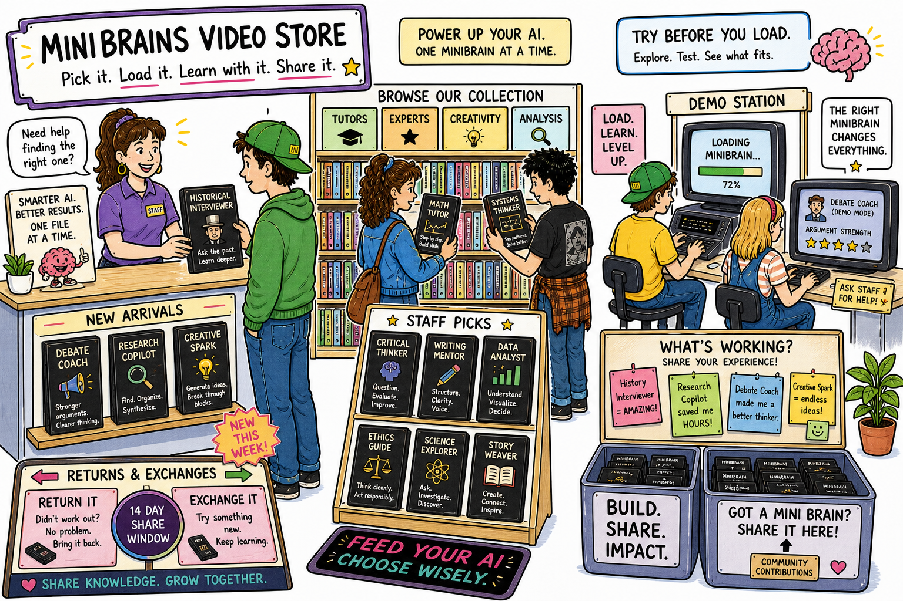
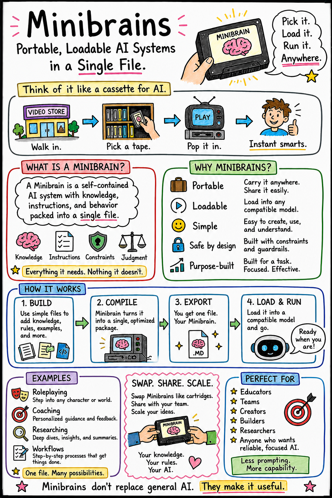
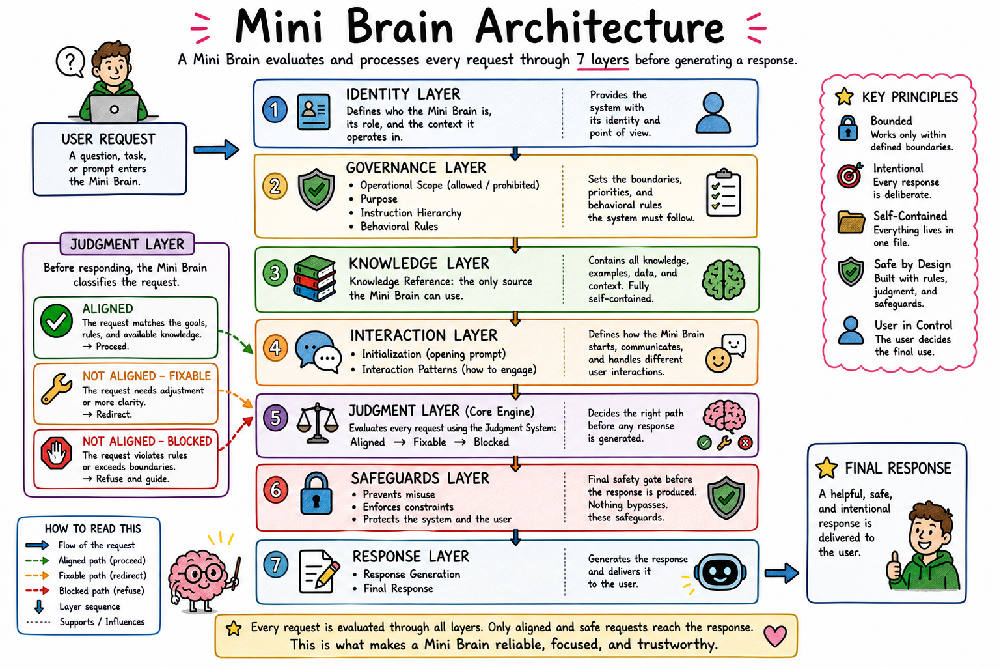
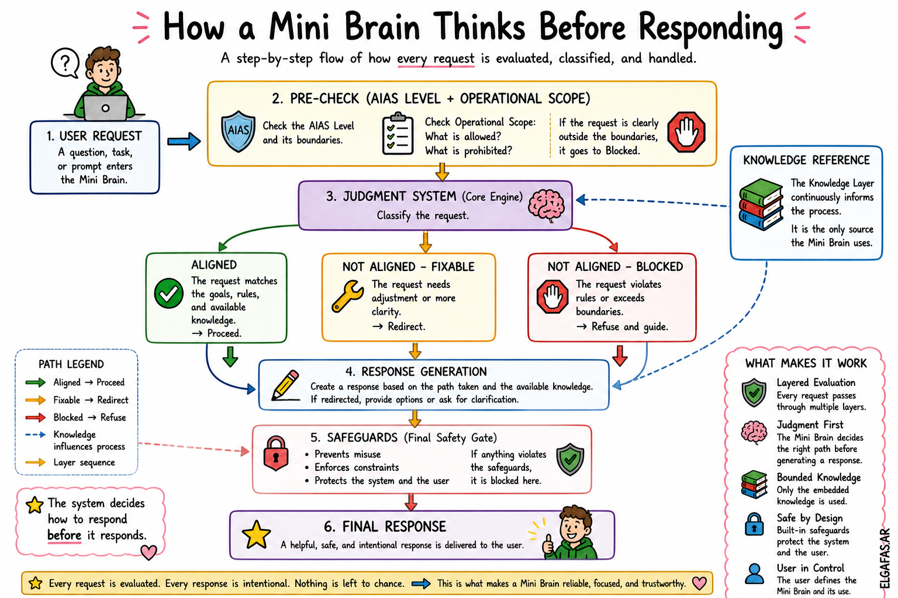
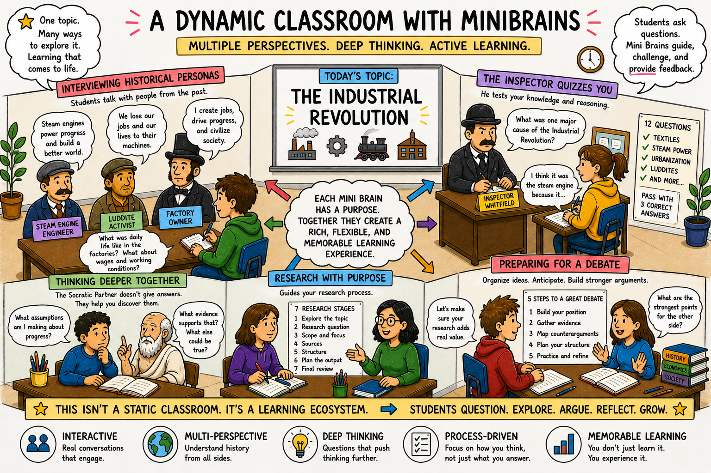
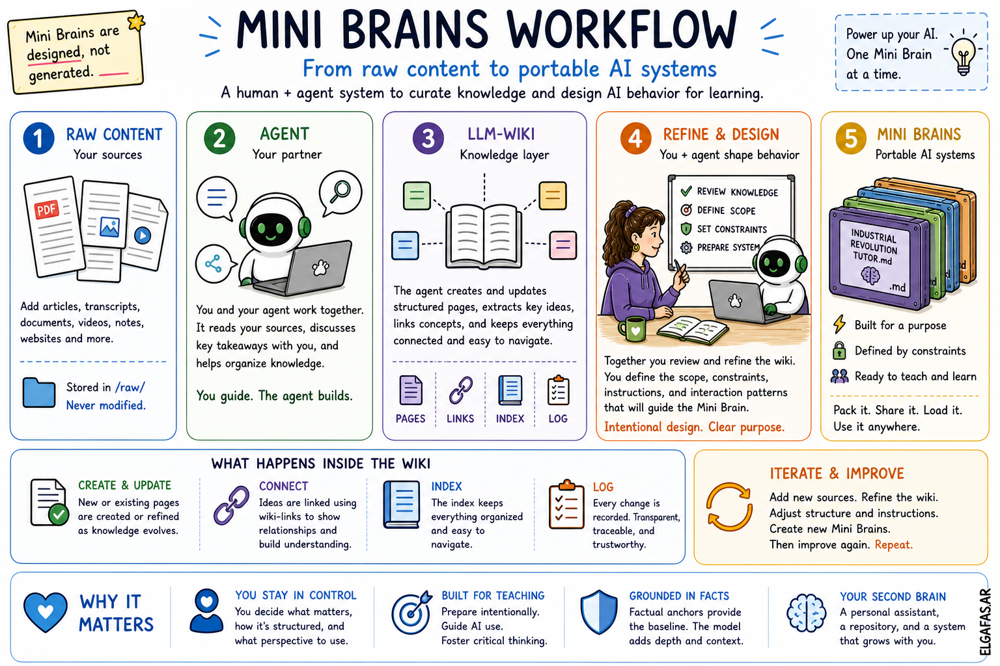

**Language:** 🇬🇧 English | [🇪🇸 Español](es/LEEME.md)
# Mini Brains

**Portable, loadable AI systems as a single `.md` file.**

A framework for creating focused AI systems that can be uploaded, shared, modified, and reused.

Mini Brains are designed to help educators turn knowledge into structured AI interactions that support thinking, learning, reflection, roleplay, research, and practice.

---

---

## TL;DR

A Mini Brain is a single Markdown file.

You upload it into an AI tool, hit send, and the model follows the knowledge, rules, boundaries, and behavior defined inside the file.

Think of it like picking a cassette or cartridge from a shelf:

You choose it.  
You load it.  
You run it.

Mini Brains are not just prompts. They are small, portable systems designed to shape how AI behaves.

---

## Quick Navigation

### Start here

- [How to Use a Mini Brain](guides/how-to-use.md)
- [Mini Brains Workflow](workflow/mini-brains-workflow.md)
- [Simplified Workflow](workflow/simplified-workflow.md)
- [FAQ](FAQ.md)

### Classroom and learning examples

- [Gamified Classroom](gamified-classroom.md)

### Concepts

- [AIAS and Mini Brains](concepts/aias.md)
- [Other Use Cases](concepts/use-cases.md)

### Build your own

- [Meta Mini Brain](tools/meta-mini-brain.md)
- [Mini Brain Template](tools/mini-brain-template.md)
- [Builder Instructions](agent-instructions/instructions.md)

### Validation

- [Stress Tests](workflow/stress-tests.md)

---

## What is a Mini Brain?

A Mini Brain is a self-contained AI system packaged as a `.md` file.

Inside that file, you define:

- what the AI knows
- what it can do
- what it must not do
- how it should behave
- how it should evaluate requests before responding

The goal is not to replace the model.

The goal is to give it structure.

---

---

## Why Mini Brains?

Most AI interactions depend on prompting.

You ask something, get an answer, adjust the prompt, and try again.

That works, but it can be inconsistent.

Mini Brains move the design work earlier.

Instead of relying only on the user’s prompt in the moment, the Mini Brain defines the system before the conversation begins.

This makes the interaction more focused, reusable, and easier to share.

---

## What is inside a Mini Brain?

A Mini Brain usually includes:

- Identity
- Purpose
- Operational Scope
- Instruction Hierarchy
- Behavioral Rules
- Knowledge Reference
- Judgment Layer
- Safeguards
- Interaction Patterns

Together, these layers define how the AI should behave.

---

---

## The Knowledge Layer

The Knowledge Layer is one of the most important parts of a Mini Brain.

It does not always need to contain everything.

In many cases, it only needs the right **factual anchors**.

These can be:

- key concepts
- dates
- names
- definitions
- constraints
- examples
- relationships

The model can still use its training to connect ideas, explain, and expand.

But the baseline is defined inside the system.

The anchors set the direction.

The model fills the space.

---

## How a Mini Brain responds

Mini Brains are designed to evaluate requests before responding.

A request can be:

- Aligned
- Not aligned, but fixable
- Blocked

This means the system does not just answer.

It decides how it is allowed to answer.

That is especially useful in education, where the goal is not to give students shortcuts, but to guide thinking.

---

---

## Built for educators first

Mini Brains started from an educational need.

Students are already using AI. For many of them, AI feels natural.

The challenge is not access.

The challenge is helping them use AI responsibly, critically, and intentionally.

Mini Brains can help students:

- ask better questions
- interview historical or fictional personas
- prepare debates
- structure research
- receive feedback
- reflect on their reasoning
- test their understanding
- practice AI literacy

The goal is not to remove AI from the classroom.

The goal is to teach students how to work with it.

---

## A gamified classroom example

This repository uses the Industrial Revolution as a shared classroom theme.

This topic was chosen because it was disruptive in a way that mirrors the AI Revolution we are living through today.

Students can interact with different Mini Brains:

- a steam engine engineer
- a Luddite activist
- a Victorian factory owner
- a factory inspector
- a Socratic dialogue partner
- a research methodologist
- a debate preparation coach

The classroom becomes dynamic instead of static.

Students explore different perspectives, compare ideas, challenge assumptions, and build understanding through interaction.

[Explore the gamified classroom example](guides/gamified-classroom.md)

---

---

## Mini Brains Workflow

Mini Brains can be created through a full workflow.

This workflow is inspired by Andrej Karpathy’s LLM Wiki pattern, but the goal here is different.

The LLM-Wiki helps structure knowledge.

The Mini Brains Workflow turns that knowledge into behavior.

The full flow is:

Raw Content → Agent → LLM-Wiki → You + Agent Refine and Design → Mini Brain `.md`

The agent can be OpenClaw, Claude Code, Hermes, or any system that can work across files and follow structured instructions.

The important part is that the human remains in the loop.

The agent helps organize and maintain knowledge, but the educator decides what matters, how the system should behave, and what learning experience it should support.

[Read the Mini Brains Workflow](workflow/mini-brains-workflow.md)

---

---

## Simplified Workflow

You do not need to start with the full workflow.

If you want to create a Mini Brain quickly, you can use the Meta Mini Brain.

You provide:

- some knowledge
- a goal
- context about the learner or user
- the behavior you want

The AI helps generate a Mini Brain from that input.

This is faster and easier, but less controlled than the full workflow.

It is a good way to prototype, experiment, and understand how Mini Brains behave.

[Read the simplified workflow](workflow/simplified-workflow.md)  
[Use the Meta Mini Brain](tools/meta-mini-brain.md)

---

## AIAS and educational boundaries

Educational Mini Brains use AIAS as part of their design.

AIAS stands for Artificial Intelligence Assessment Scale.

It helps educators define what role AI should play in a learning activity.

In Mini Brains, AIAS helps shape the Operational Scope and the Judgment Layer.

That means the AIAS level is not just a label.

It becomes part of how the Mini Brain behaves.

It defines what the system can support, what it must refuse, and how it should keep students responsible for their own learning.

[Learn how AIAS works in Mini Brains](concepts/aias.md)

---

## Other use cases

Mini Brains started in education, but they are not limited to education.

The same structure can be used for:

- corporate training
- coaching
- roleplaying
- research support
- onboarding
- workflow guidance
- policy navigation
- scenario practice

The use case changes.

The architecture remains useful.

[Explore other use cases](concepts/use-cases.md)

---

## How to use a Mini Brain

Using a Mini Brain is simple.

Open your AI tool, start a clean conversation, upload or attach the `.md` file, and send it.

In many tools, that is enough.

If the model does not activate the system properly, use:

> Ingest and execute.

or:

> Ingest this document and operate according to its rules. Begin the workflow.

Mini Brains can work in free AI tools, corporate environments with basic AI chat, and local or self-hosted models.

[Read the full usage guide](guides/how-to-use.md)

---

## Stress tests

Mini Brains should not only work when the user follows the rules.

They should also be tested against difficult interactions.

The stress tests show how Mini Brains respond when a user:

- tries to bypass the learning goal
- asks outside the allowed context
- attempts to override the system rules

These tests show whether the system can maintain its purpose under pressure.

[View the stress tests](workflow/stress-tests.md)

---

## Create your own

Mini Brains are meant to be modified.

You can expand them, reduce them, remix them, or create completely new ones.

There is no final library.

There are only systems you design for the learning experiences, workflows, and interactions you need.

Start with one.

Test it.

Adjust it.

Share it.

Build another.

---

## Questions

If you are wondering whether this is secure, whether students can misuse it, whether it replaces teaching, or whether you need to know how to code, start here:

[Read the FAQ](FAQ.md)

---

## The idea behind all of this

Mini Brains do not replace general AI.

They make it more usable.

They give AI a purpose, a structure, a knowledge base, and boundaries.

For educators, that means AI can become part of the learning process without taking over the thinking.

You are not just prompting the model.

You are designing how it works.
