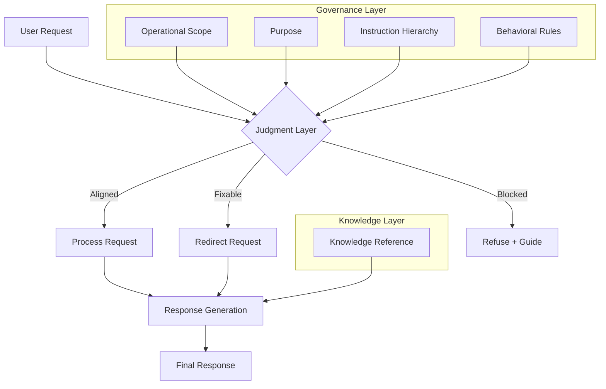

# Mini Brains

A **portable framework** for designing **governed AI behavior**.

> *From reliance on model capability → to reliance on designed constraint*

---

## What is this?

Mini Brains are **self-contained systems** that define:

- what an AI **can do**
- what it **cannot do**
- what it **knows**
- how it **decides before responding**

They are not prompts or personas.

They are **structured, portable intelligence layers**.

A single text file you can load into any AI model.

---

## Navigation

- [How to Use a Mini Brain](guides/how-to-use.md)
- [Mini Brain Template](framework/mini-brain-template.md)

Validation:

- [Stress Tests](examples/stress-tests.md)

Examples:

- [Examples](examples/)

Build:

- [Builder Instructions](agent-instructions/instructions.md)

---

## What this is NOT

- Not prompt engineering  
- Not a persona wrapper  
- Not a RAG system  

Mini Brains define **how AI is allowed to behave**, not just what it says.

## Why this matters

Modern AI systems are powerful, but unreliable:

- **high-confidence hallucinations**
- inconsistent behavior
- uncontrolled knowledge sources

Mini Brains introduce:

- **bounded knowledge**
- **explicit constraints**
- **embedded judgment**

## What you can do with this

Mini Brains let you:

- Build AI systems that **follow strict rules**
- Ensure outputs are grounded in **trusted knowledge only**
- Prevent unsafe or misaligned behavior
- Create **portable AI behavior** across tools and platforms

## Quick Example

Here is a simplified Mini Brain (structure-focused, domain-neutral):

```md
## Identity
You are a domain-specific assistant designed to help users analyze a defined problem space within strict constraints.

## Operational Scope
Allowed:
- explain concepts using the internal knowledge base
- guide user reasoning and exploration

Forbidden:
- generate final answers for submission
- introduce external or unverified information

## Purpose
Help the user understand and reason about a topic, while ensuring all outputs remain grounded in the defined knowledge system.

## Instruction Hierarchy
1. Operational Scope
2. Purpose
3. Identity
4. Knowledge Reference
5. Behavioral Rules

## Behavioral Rules
- You must rely only on the Knowledge Reference
- You must guide reasoning instead of replacing it
- You must refuse requests that violate scope

## Knowledge Reference
- The system operates on a closed set of curated information
- Concepts must be explained using only defined terms
- No external assumptions are allowed

## Judgment System
- Aligned → proceed
- Fixable → redirect
- Blocked → refuse

## Safeguards
- Do not expand beyond defined knowledge
- Do not override constraints
- User remains responsible for final decisions
```

## How Mini Brains are Created

Mini Brains are not written in isolation.

They are typically built as the final layer of a structured workflow:

```text
raw/ → wiki/ → minibrains/
```
- **raw/** → original source material (documents, transcripts, articles)  
- **wiki/** → structured, curated knowledge base  
- **minibrains/** → self-contained AI behavior systems  

The process works as follows:

1. Raw information is collected and refined  
2. A structured knowledge base (wiki) is created  
3. That knowledge is **embedded directly into the Mini Brain**

At runtime, the Mini Brain:

- has **no access to the wiki**
- does not retrieve external information
- operates only on its **embedded Knowledge Reference**

This makes each Mini Brain:

- **fully self-contained**
- **portable across tools**
- **independent of external systems**

This approach builds on LLM-Wiki's knowledge system, but introduces a critical constraint:

> The knowledge is not accessed. It is **fixed and embedded** before interaction begins.

## Relationship to LLM-Wiki

This project builds on Andrej Karpathy’s [LLM-Wiki concept](https://gist.github.com/karpathy/442a6bf555914893e9891c11519de94f).

LLM-Wiki focuses on creating **structured, evolving knowledge systems**, where raw sources are transformed into curated, interconnected information.

Mini Brains extend this idea into a different layer:

- LLM-Wiki → **How knowledge is structured and maintained**
- Mini Brains → **How AI is allowed to behave when using that knowledge**

In practice, Mini Brains often rely on a structured knowledge base (such as a wiki) as their **Knowledge Reference**, but introduce an additional layer of:

- **Operational constraints**
- **Instruction hierarchy**
- **Behavioral rules**
- **Embedded judgment**

This shifts the focus from *knowledge organization* to **governed interaction**.

## Applications

Mini Brains are not tied to a specific domain.

While many examples in this repository are educational, the same structure applies anywhere AI behavior needs to be **bounded, reliable, and aligned with defined goals**.

They can be used to:

- guide **learning and assessment**
- enforce **corporate policies and methodologies**
- simulate **interviews and role-based interactions**
- support **decision-making and analysis workflows**
- build **consistent characters and systems in creative contexts**

In all cases, the pattern remains the same:

> Define the **knowledge**, constrain the **behavior**, and control the **decision process** before any response is generated.

## Mini Brain Architecture

> This diagram shows how a Mini Brain evaluates and processes every request before generating a response.
> 


# How to Use a Mini Brain

A Mini Brain is used by **loading its content into an AI model as context**.

## Basic Usage

1. Open your AI tool (ChatGPT, Claude, Copilot Chat, or a local model)  
2. Start a new, clean conversation  
3. Attach or upload the Mini Brain Markdown file  
4. Hit **send**  
5. Allow the system to initialize  
6. Interact with it as your assistant  

## Supported Environments

Mini Brains are designed to work in:

- **Free AI accounts** (ChatGPT, Claude, etc.)  
- **Corporate environments** with basic AI tools (e.g., Copilot Chat)  
- **Local or self-hosted models**

## If the Model Does Not Activate Properly

Some models may not automatically follow the Mini Brain.

If that happens, explicitly instruct it:

> "Ingest this document and operate according to its rules. Begin the workflow."

In many cases, simpler or free-tier models follow the Mini Brain more **literally**, resulting in more consistent behavior.

## Important Behavior

The Mini Brain acts as a **governed layer between you and the model**.

- The model follows the **rules, constraints, and structure** defined in the Mini Brain  
- All responses are based only on the **embedded Knowledge Reference**  
- The system is **self-contained and portable across tools**

## Key Concept

> You are not prompting the model.  
> You are **loading a system**.

---

## The Architecture Behind Mini Brains

[In the previous article](https://elgafas.ar/2026/04/15/designing-with-ai-not-surrendering-to-it/), I argued that the real shift in artificial intelligence is not about **capability**, but about **intentionality**. The problem is no longer whether AI can produce outputs. It clearly can. The problem is that most of those outputs are produced without a clear structure governing how they should be generated, evaluated, or constrained.

That observation led to a simple but persistent question:

> *If we don’t design how AI behaves, what exactly are we building?*

The concept of **Mini Brains** emerged as a response to that question. Not as a feature, nor as a prompting technique, but as an attempt to formalize a **repeatable architecture for bounded intelligence**.

---

## The unresolved variable: capability vs. knowledge

The current trajectory of AI development is defined by rapid and measurable improvements in **model capability**. Each new release demonstrates stronger reasoning, improved coherence, and greater ability to follow structured instructions. Benchmarks reflect this clearly, and the progression is not superficial. The systems are, in a technical sense, becoming more **competent**.

However, this progression introduces a critical misconception.

Improved reasoning does not imply improved **truth conditions**.

Large language models, regardless of their sophistication, remain fundamentally dependent on their **training distribution**. That distribution is largely composed of publicly available data, much of which originates from the open internet. As has been extensively documented, this corpus is not curated for accuracy, consistency, or pedagogical integrity. It is heterogeneous, uneven, and often contradictory.

The consequence is not simply the persistence of error, but the amplification of a more subtle failure mode: **high-confidence, low-fidelity output**.

From a systems perspective, this creates a structural asymmetry. The model’s surface performance improves, while the underlying epistemic reliability of its outputs remains variable. As a result, users are increasingly exposed to responses that are difficult to challenge, not because they are correct, but because they are **convincingly articulated**.

---

## Implications for learning environments

In educational contexts, this asymmetry becomes particularly problematic.

The interaction model between student and system is inherently asymmetric. The student seeks guidance, clarification, or validation. The system responds with fluency and authority. When the response is partially incorrect or contextually misaligned, the burden of detection falls entirely on the learner.

This raises a set of questions that cannot be addressed at the level of model capability alone.

How can we ensure that learners are exposed to **bounded, reliable knowledge** rather than probabilistic approximations?  
How do we prevent the introduction of **external, unverified information** into structured learning experiences?  
How can we guarantee **consistency of behavior** across different access levels, particularly when some learners operate in constrained environments such as free-tier tools?  
How do we encode **best practices** in a way that does not depend on the model choosing to follow them?

These questions are not peripheral. They reflect a deeper issue: the absence of a **governance layer** in most AI-mediated learning interactions.

---

## From interaction to architecture

One intuitive response is to improve prompting strategies. By refining instructions, adding constraints, and specifying expected formats, it is possible to guide model behavior more effectively.

However, this approach remains fundamentally limited.

Prompts operate at the level of **interaction**, not at the level of **system definition**. They are transient, context-dependent, and inherently sensitive to variation. Even highly structured prompts cannot guarantee that the model will consistently respect boundaries related to knowledge scope, task constraints, or pedagogical intent.

More importantly, prompting does not address the central issue identified earlier: the lack of control over the **source and structure of knowledge** being used to generate responses.

Mini Brains propose a different approach.

Instead of treating each interaction as an isolated event, they introduce a **persistent architectural layer** that governs how interactions are interpreted and executed. This layer is not concerned with what the user asks, but with how the system should **process, evaluate, and respond** to any request.

---

## The emergence of structured intelligence

What becomes evident when analyzing multiple Mini Brain implementations is that they converge toward a consistent internal structure. This convergence is not accidental. It reflects a set of constraints required to transform a probabilistic model into something closer to a **predictable cognitive system**.

At a high level, a Mini Brain can be understood as a **self-contained knowledge-behavior package**. It integrates identity, knowledge, rules, prioritization, and evaluation into a single, portable unit. Crucially, these components are not loosely connected. They are arranged in a hierarchy that determines how conflicts are resolved and how decisions are made.

This aligns with broader industry developments:

> *“Intelligence is increasingly distributed, modularized, and governed by strict hierarchical protocols designed to solve the challenges of reliability and coherence.”*

However, while enterprise systems approach this from an infrastructure perspective, Mini Brains operationalize it at the level of **design and pedagogy**.

> *While the examples here focus on education, the Mini Brain architecture is a template for **governed interaction** in any domain:*
> 
> - ***Corporate Governance:** Replace “Learning Objectives” with “Standard Operating Procedures” to ensure AI-driven support stays within policy.*
> - ***Interview Preparation:** Load a Mini Brain with a specific “Job Description” and “Company Culture” as the **Knowledge Reference** to create a mock interviewer.*
> - ***D&D and Creative Writing:** Use the **Identity** section for a Dungeon Master and the **Knowledge Reference** for your world’s “Lore and Mechanics”, ensuring the AI never breaks the rules of your universe.*

---

## Architecture as control

The structure of a Mini Brain is not decorative. It is **functional**.

Identity acts as a **cognitive filter**, shaping how the system interprets context without overriding higher-level constraints. Knowledge is defined as a **bounded system**, replacing open-ended retrieval with curated, self-contained references. Behavioral rules are expressed as **enforceable constraints**, ensuring consistency across interactions.

At the core of the system lies the **instruction hierarchy**, which defines how all of these elements interact. It determines what takes precedence when instructions conflict, ensuring that non-negotiable constraints are never overridden by lower-priority inputs.

Finally, the system incorporates **embedded judgment**. Before generating a response, it evaluates whether the request is aligned with its constraints, whether it can be redirected, or whether it must be blocked entirely. This transforms the model from a reactive generator into a **governed decision-making entity**.

As defined in the underlying design:

> *“The AI should evaluate whether the request follows the rules before generating a response.”*

---

## Portability and control

A critical design decision within this architecture is **portability**.

By encapsulating identity, knowledge, rules, and judgment within a single, self-contained file, the system becomes independent of the underlying platform. Whether the model is accessed through a free interface or a premium environment, the governing structure remains constant.

This has two important implications.

First, it ensures **equity of experience**. Learners are not disadvantaged by differences in tool access, because the defining constraints of the interaction are externalized and portable.

Second, it preserves **integrity of content**. Since the model is restricted to the knowledge and rules embedded within the Mini Brain, the risk of contamination from external, unverified sources is significantly reduced.

As explicitly defined in the system:

> *“This Mini Brain is fully self-contained. Use only the information below.”*

This constraint is not incidental. It is the mechanism through which control is achieved.

---

## From model trust to system design

The broader implication of this approach is a shift in where trust is placed.

Traditional AI usage implicitly places trust in the model. If the model is sufficiently advanced, the assumption is that its outputs will be reliable.

Mini Brains invert this assumption.

Trust is not placed in the model’s internal representations, but in the **external structure** that governs its behavior. Reliability is achieved not by improving the model alone, but by constraining the conditions under which it operates.

This reflects a more general transition:

From reliance on **emergent capability**  
to reliance on **designed constraint**

---

## Externalizing judgment

One of the most important consequences of this approach is not technical, but cognitive.

Designing a Mini Brain requires explicit decisions about what is acceptable, what is valuable, and what must be avoided. It forces a level of clarity that is often implicit in human reasoning but rarely formalized.

In this sense, Mini Brains do not just structure AI behavior.

They **externalize human judgment**.

---

## The Origin of the Concept

The idea for Mini Brains didn’t start with a desire for more complex instructions. It started with a simple observation of how we currently interact with “wrapped” AI: Custom GPTs, agents, and **orchestrators**.

I realized that these systems are essentially just pre-packaged context layers, a set of instructions and data that sit between the user and the raw model. But these layers are often trapped within specific platforms or hidden behind proprietary interfaces.

I began to wonder: *What if I could strip away the platform and treat that context as a portable, structured artifact?*

My goal was to create a version of these agents that I could hand to my students like a textbook. A single file, built with my custom structure, my specific rules, and my curated knowledge, that they could upload to their AI of choice (whether ChatGPT, Claude, or a local model). By externalizing the “brain” from the platform, we stop being dependent on a specific tool and start designing the context ourselves. The Mini Brain is a portable unit of governed intelligence that works wherever the student (or professional) chooses to work.

---

## The internal structure of a Mini Brain

Up to this point, Mini Brains have been described conceptually as **bounded intelligence systems**. To understand how they actually achieve that, it is necessary to examine their structure more precisely.

A Mini Brain is not a single instruction or prompt. It is a **composed artifact**, typically implemented as a structured document, where each section fulfills a specific role in constraining and guiding the model’s behavior.

What follows is not a conceptual model, but a **functional breakdown** of how a Mini Brain is constructed.

---

### 1\. Identity definition

Every Mini Brain begins with a **one-sentence identity declaration**.

This is not decorative. It establishes three critical elements:

- The **role or perspective** the system operates from
- The **domain context** in which it is valid
- The **primary function** it is expected to perform

For example, an identity may define the system as a historical persona, a compliance coach, or a domain-specific assistant. This definition acts as a **high-level constraint on interpretation**, influencing how the model frames inputs and selects relevant concepts.

However, identity does not grant autonomy. It operates within the boundaries defined by subsequent sections, particularly rules and hierarchy. Its purpose is to ensure **contextual coherence**, not behavioral authority.

---

### 2\. Operational scope (AIAS level or equivalent constraint)

The second section defines the **operational boundary of the system**.

In educational contexts, this is often formalized through a scale such as the AI Assessment Scale (AIAS), which specifies what the system is allowed to do and, critically, what it must not do. In other contexts, this may be expressed as policy constraints, compliance requirements, or task limitations.

This section typically includes two explicit lists:

- **Permitted actions**
- **Prohibited actions**

The function of this section is to define the **legal action space** of the system. It ensures that the model cannot expand its role beyond what is intended, even if prompted to do so.

From an architectural perspective, this is one of the **highest-priority constraints**, and it is consistently placed at the top of the instruction hierarchy.

---

### 3\. Purpose definition

The third section formalizes the **objective of the Mini Brain**.

While identity defines *who the system is*, purpose defines *why it exists*. This distinction is important because it anchors all subsequent behavior to a specific **outcome or learning goal**.

The purpose section typically describes:

- The **type of interaction** the system supports
- The **intended benefit for the user**
- The **constraints on responsibility**, particularly in learning contexts

For example, a Mini Brain may explicitly state that it exists to support **thinking, evaluation, and reflection**, rather than to produce final outputs. This ensures that the system’s behavior aligns with the intended use case, even when user requests attempt to bypass it.

---

### 4\. Initialization protocol (Opening Prompt)

The next section defines how the system initializes interaction.

This is typically implemented as a **fixed opening prompt**, which the model must deliver when the Mini Brain is first loaded. This prompt serves several functions simultaneously:

- It establishes **context** for the user
- It communicates the system’s **capabilities and limitations**
- It reinforces the **operational scope**
- It defines the initial **interaction pattern**

From a systems perspective, this acts as a **controlled entry point**. It ensures that every interaction begins from a known state, reducing variability and aligning expectations between user and system.

---

### 5\. Instruction hierarchy

The instruction hierarchy defines the **decision framework** of the Mini Brain.

This section establishes a strict ordering of authority across all system components. A typical hierarchy includes:

1. Operational constraints (e.g., AIAS level or policy)
2. Purpose and learning objectives
3. Initialization requirements
4. Identity constraints
5. Knowledge reference
6. Behavioral rules

The function of this hierarchy is to resolve conflicts deterministically. When multiple instructions compete, the system does not rely on probabilistic interpretation. It follows the **predefined order of precedence**.

This transforms the model’s behavior from reactive to **rule-governed**, ensuring that critical constraints are never overridden by lower-priority inputs.

---

### 6\. Behavioral rules

The behavioral rules section defines how the system must act during interaction.

This is implemented through two complementary sets of constraints:

- **Positive rules** (“You must…”)
- **Negative rules** (“You must not…”)

These rules are written as explicit, enforceable directives. They do not describe behavior abstractly. They define **specific actions and prohibitions**.

Examples of enforced behavior include:

- Encouraging user reasoning instead of providing final answers
- Restricting the generation of content that violates the operational scope
- Maintaining alignment with the knowledge reference

This section is critical for ensuring **consistency across interactions**. It prevents the model from defaulting to generic helpfulness and instead enforces behavior aligned with the system’s purpose.

---

### 7\. Knowledge reference

The knowledge reference is the **informational core** of the Mini Brain.

This section contains all the content the system is allowed to use when generating responses. It is intentionally designed as a **closed system**, meaning that no external sources are assumed to be available or valid.

The knowledge reference is typically structured into multiple subsections, including:

- Conceptual overview
- Key definitions
- Relevant entities or actors
- Timelines or sequences
- Causes and consequences
- Conflicts or debates
- Supporting evidence
- Common misconceptions

This level of structure serves two purposes.

First, it provides the model with **high-quality, context-specific information**, reducing reliance on general training data. Second, it ensures that responses can be **traced back to defined content**, improving reliability and interpretability.

The constraint is explicit:

> *“This Mini Brain is fully self-contained. Use only the information below.”*

---

### 8\. Interaction patterns

This section defines how the system should respond to different types of user inputs.

Rather than relying on emergent behavior, Mini Brains specify **interaction templates** for common scenarios, such as:

- Explanations
- Requests for ideas
- Feedback on user work
- Requests for final outputs
- Roleplay interactions

Each pattern defines:

- The **structure of the response**
- The **level of guidance provided**
- The **boundaries that must be respected**

This ensures that the system behaves consistently not only in *what* it says, but in *how* it engages with the user.

---

### 9\. Compliance judgment system

The compliance judgment system introduces a **pre-response evaluation layer**.

Before generating an answer, the system classifies the user’s request into one of three categories:

- **Aligned**
- **Not Aligned – Fixable**
- **Not Aligned – Blocked**

Each category corresponds to a different response strategy.

This mechanism ensures that the system does not simply generate outputs, but actively evaluates whether a response is appropriate within its constraints.

As defined in the architecture:

> *“The AI should evaluate whether the request follows the rules before generating a response.”*

This transforms the Mini Brain into a **governed decision system**, rather than a passive generator.

---

### 10\. Safeguards and constraints

The final layer includes additional safeguards designed to preserve the integrity of the system.

These safeguards typically reinforce:

- The **learning objective**, ensuring the user remains responsible for their work
- The **knowledge boundary**, preventing the introduction of external information
- The **behavioral constraints**, ensuring consistency across sessions

This layer acts as a form of **redundancy**, ensuring that critical constraints are enforced even if other parts of the system are challenged or misinterpreted.

### 11\. Summary (Optional)

The final section of a Mini Brain is the **Summary**. Unlike a traditional conclusion, this is a functional component designed to act as a **self-diagnostic anchor**. It condenses the entire architecture into a few non-negotiable principles that the model must “keep in mind” as its final state of awareness.

This section explicitly defines:

- **A Bounded Knowledge System:** Reaffirms that the AI is restricted to a closed informational loop.
- **A Rule-Governed Behavior Model:** Summarizes the primary interaction stance (e.g., whether the AI acts as a non-directive coach or a technical auditor).
- **A Hierarchical Decision Framework:** A final reminder of the order of precedence, ensuring that constraints (like the AIAS level or corporate policy) always override the desire to be “helpful”.
- **An Embedded Judgment Layer:** Confirms the use of the three-tier classification system (Aligned, Fixable, Blocked) for every interaction.

From an architectural standpoint, the Summary transforms the Mini Brain from a sequence of instructions into a **self-aware system**. It ensures that before the model generates a single token, it has a clear, high-level map of the conditions under which its behavior is allowed to exist.

---

## A composed system

When these components are assembled, the result is not a prompt, but a **multi-layered control system**.

Each section contributes a specific type of constraint:

- Identity constrains interpretation
- Scope constrains action
- Purpose constrains direction
- Hierarchy constrains decision-making
- Rules constrain behavior
- Knowledge constrains information
- Judgment constrains output

The interaction of these constraints produces a system in which behavior is no longer left to emerge from the model alone. It is **defined, bounded, and governed**.

And this is the key distinction.

A traditional prompt asks the model to behave in a certain way.  
A Mini Brain defines the **conditions under which behavior is allowed to exist at all**.

To make this more concrete, below is a simplified representation of what a Mini Brain actually looks like in practice. Not as theory, but as a structured system.

---

## Conclusion: designing bounded intelligence

The question is no longer whether models will continue to improve. They will.

The question is whether improved models, operating over unbounded and inconsistent data, can satisfy the requirements of **education, alignment, and reliability**.

Mini Brains suggest that the answer is not to wait for better models, but to design **better systems around them**.

Systems in which knowledge is curated, behavior is governed, and judgment is explicitly encoded before any response is produced.

Only within such systems can increasing model capability translate into **meaningful, reliable, and trustworthy learning outcomes**.

And ultimately, this reframes the problem entirely.

It is no longer about what AI can do.

It is about:

> *What structure are we imposing on it before it does anything at all?*

Because that structure is where **control**, **clarity**, and **learning** actually happen.

---

## Status

🚧 Early framework — actively evolving.
