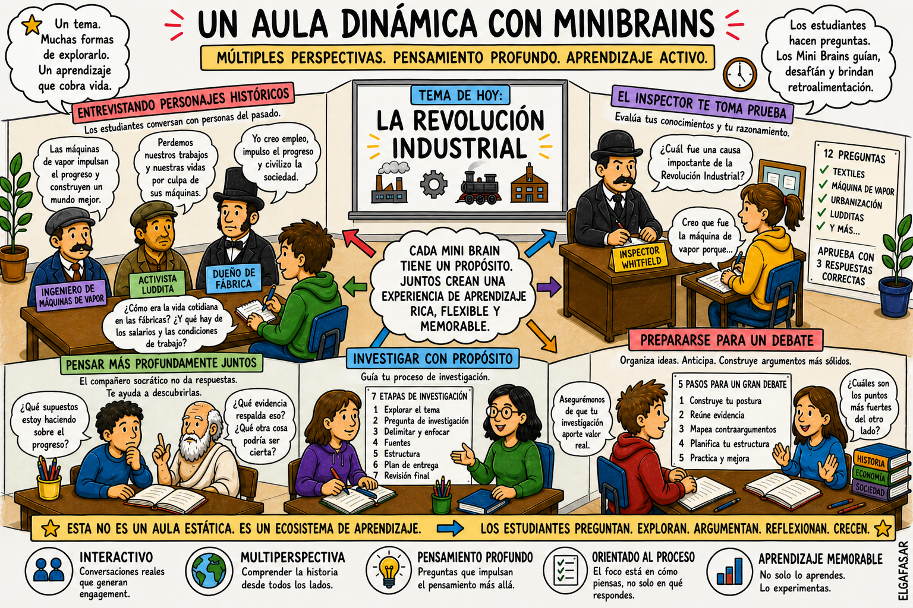

# Gamificación del aula con Mini Brains

## El verdadero propósito de esta propuesta

Esta no es simplemente una clase sobre la Revolución Industrial. Es una arquitectura diseñada para enseñar a los estudiantes a **pensar, trabajar y aprender junto a la IA**.

Los estudiantes de hoy ya conviven con la IA, pero a menudo carecen de:
- Estructura y criterio.
- Conciencia sobre las limitaciones del modelo.
- Un sentido de responsabilidad sobre su propio proceso cognitivo.

Este enfoque no busca prohibir la IA, sino **moldear su comportamiento y la forma en que los estudiantes interactúan con ella**.

---

## Por qué la Revolución Industrial

Elegimos este período porque es el espejo histórico de nuestra era actual:
- Un cambio tecnológico acelerado.
- La transformación radical del trabajo.
- Narrativas en conflicto e incertidumbre sobre el futuro.

Al explorar este hito, los estudiantes no solo estudian historia; aprenden a identificar **cómo se siente la disrupción** y cómo diferentes grupos experimentan el cambio. Son los mismos patrones que vemos hoy con la IA.

---

## El aula como ecosistema dinámico

En lugar de una lección lineal, el aula se transforma en un **conjunto de módulos interconectados**. Los estudiantes se mueven según su curiosidad, necesidades y ritmo de progreso. Cada módulo representa una dimensión distinta de la relación con el conocimiento.

---

---

> **Nota:** Los archivos de los Mini Brains residen en su carpeta original `/minibrains` para evitar duplicidad. Aunque las instrucciones del archivo estén en inglés, se pueden ejecutar en español con el comando: **"Ingerir y ejecutar en español."**

---

## Módulo 1 — El arte de preguntar

El punto de partida es crítico: aprender a interrogar al sistema.

**Herramienta:** [Ingeniero de máquina de vapor (Nivel 3)](../../minibrains/steam-engine-engineer-level-3.md)

![[es/assets/steam-engine-engineer-3.png|296]]

Este Mini Brain no entrega respuestas; obliga al estudiante a:
- Refinar sus preguntas.
- Identificar vacíos de información.
- Mejorar la claridad de sus planteamientos.

---

## Módulo 2 — Habitar la perspectiva

Aquí la historia deja de ser un texto estático para volverse una interacción.

**Herramienta:** [Ingeniero de máquina de vapor (Nivel 5)](../../minibrains/steam-engine-engineer-level-5.md)

![[es/assets/steam-engine-engineer-5.png|296]]

Los estudiantes exploran la vida en las fábricas, la técnica y las condiciones laborales. El objetivo es que noten que **toda perspectiva está situada en una posición específica**.

---

## Módulo 3 — Enfrentar la tensión

El conflicto entra en escena. La comprensión ya no se entrega; se revela gradualmente.

**Herramienta:** [Activista ludita (Nivel 4)](../../minibrains/luddite-activist-level-4.md)

![[es/assets/luddite-activist.png|296]]

El estudiante debe demostrar conocimiento y postura para avanzar, pasando del consumo pasivo a la **participación activa**.

---

## Módulo 4 — El reverso de la moneda

Para fomentar el pensamiento crítico, los estudiantes deben confrontar una visión opuesta.

**Herramienta:** [Dueño de fábrica victoriano (Nivel 4)](../../minibrains/victorian-factory-owner-level-4.md)

![[es/assets/victorian-factory-owner.png|296]]

Aquí aparecen los sesgos, las justificaciones económicas y las contradicciones. Es el momento donde el análisis crítico se vuelve inevitable.

---

## Módulo 5 — El gimnasio del pensamiento

Durante todo el recorrido, los alumnos tienen acceso a un espacio de pura reflexión.

**Herramienta:** [Compañero de diálogo socrático (Nivel 3)](../../minibrains/socratic-dialogue-partner-level-3.md)

![[es/assets/socratic-dialogue-partner.png|296]]

Este sistema desafía supuestos y empuja hacia un razonamiento profundo. La consigna es clara: **el objetivo es pensar, no conseguir la solución**.

---

## Módulo 6 — Estructura y rigor

Para formalizar lo aprendido y evitar trabajos superficiales.

**Herramienta:** [Metodólogo de investigación (Nivel 3)](../../minibrains/research-methodologist-level-3.md)

![[es/assets/research-methodologist.png|296]]

Ayuda a definir el alcance, organizar la información y dar una estructura sólida al resultado final.

---

## Módulo 7 — Defensa y argumentación

Preparación para la confrontación de ideas.

**Herramienta:** [Coach de preparación para debate (Nivel 3)](../../minibrains/debate-prep-coach-level-3.md)

![[es/assets/debate-prep-coach.png|296]]

Aprenden a construir posturas, anticipar contraargumentos y practicar respuestas. El sistema no argumenta por ellos; los entrena para que ellos lo hagan.

---

## Módulo 8 — Validación de la comprensión

El test final de razonamiento.

**Herramienta:** [Inspector de fábrica (Nivel 3)](../../minibrains/factory-inspector-level-3.md)

![[es/assets/factory-inspector.png|296]]

Este Mini Brain lanza preguntas impredecibles que premian el pensamiento lógico sobre la memorización.

---

## ¿Qué hace única a esta experiencia?

No es una simple secuencia de herramientas, es un **sistema de aprendizaje no lineal**. Los estudiantes revisitan ideas, conectan perspectivas y refinan su pensamiento de forma dinámica.

---

## El impacto real

Al final del proceso, no solo conocen la Revolución Industrial; han aprendido a:
- Trabajar con IA sin volverse dependientes.
- Cuestionar los resultados en lugar de aceptarlos ciegamente.
- Operar con éxito en un mundo donde la IA es parte del proceso creativo y analítico.

> Los Mini Brains no eliminan la IA del aula; la hacen **usable y pedagógicamente valiosa**.

---

## Seguí explorando

- [Cómo usar un Mini Brain](es/how-to-use.md)
- [Pruebas de Estrés](es/workflow/stress-tests.md)
- [AIAS y Mini Brains](es/concepts/aias.md)
- [Otros casos de uso](es/concepts/use-cases.md)