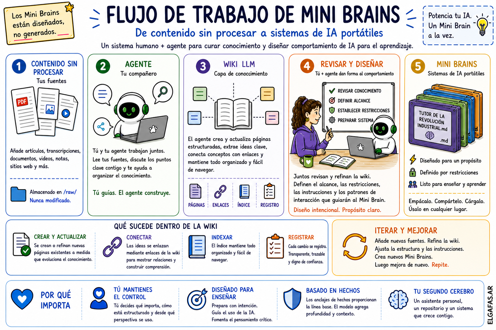

# Workflow de Mini Brains

---

## El origen de este enfoque

Este flujo de trabajo está inspirado en la **LLM Wiki de Andrej Karpathy**  
https://gist.github.com/karpathy/442a6bf555914893e9891c11519de94f

La premisa es simple pero potente: en lugar de buscar información cada vez que hacés una pregunta, el sistema construye una base de conocimiento estructurada que evoluciona con el tiempo.

Lo que presentamos aquí es una extensión práctica de esa idea.

En lugar de quedarnos solo en el conocimiento, este workflow da un paso fundamental:

**Transforma el conocimiento en comportamiento.**

---

## Una forma distinta de interactuar con la IA

La mayoría de las personas utiliza la IA de forma cíclica y reactiva.

Lanzan una pregunta, reciben una respuesta, ajustan el *prompt* y vuelven a intentar. Funciona, pero es efímero. Cada interacción nace de cero y la calidad depende de qué tan inspirado estés para guiar al modelo en ese instante.

Con el tiempo, sentís que no estás construyendo nada sólido; solo estás aprendiendo a preguntar mejor.

---

Este workflow cambia las reglas del juego.

En lugar de reaccionar a lo que la IA genera, diseñás el sistema que produce esos resultados.

No lo hacés mediante código, sino a través de **estructura, intención e iteración**.

---

## Todo comienza con lo que ya tenés

El punto de partida es tu propio material.

Artículos, transcripciones, notas, documentos, videos; los mismos recursos que ya usás para preparar tus clases o proyectos.

Sin complicaciones. Sin herramientas nuevas que aprender.

Estas fuentes se preservan tal cual. No se modifican ni se reescriben; se mantienen como tu punto de referencia absoluto y tu fuente de verdad.

---

## Colaboración, no ejecución

Aquí trabajás a la par de un agente.

Puede ser OpenClaw, Claude Code, Hermes o cualquier sistema capaz de gestionar múltiples archivos. Pero lo importante no es la herramienta, sino la **dinámica de trabajo**.

No le pedís respuestas al agente; le pedís que te ayude a **construir**.

El agente lee tu material, ayuda a organizarlo, conecta ideas y mantiene todo al día mientras tu comprensión del tema evoluciona. Con el tiempo, deja de ser una herramienta para convertirse en un colaborador estratégico.

Si querés ver el archivo de instrucciones real que guía al agente en este proceso, consultá:

[Instrucciones para construir Mini Brains](../../agent-instructions/instructions.md)

---

## Del contenido al conocimiento

A medida que sumás fuentes, sucede algo interesante.

Los documentos aislados empiezan a formar una estructura. Las ideas se conectan, los conceptos se cruzan entre fuentes y las relaciones se vuelven visibles.

Esta es la capa **LLM-Wiki**.

Tu contenido bruto se transforma en conocimiento estructurado. No es un proceso automático ni a ciegas, sino una evolución donde el agente propone cambios, actualiza páginas y registra el progreso, mientras vos mantenés el control total del rumbo. El sistema se encarga del mantenimiento; vos, de la dirección.

---

## Del conocimiento al diseño

Aquí es donde el workflow se vuelve realmente personal.

Antes de que algo se convierta en un Mini Brain, hacés una pausa. Revisás el conocimiento acumulado y decidís qué es lo fundamental.

Definís cómo debe actuar el sistema, qué debe evitar y cuál será su tono. Esto no es generación de contenido; es **diseño de experiencia**. Estás moldeando la identidad del sistema junto con el agente.

---

## El resultado no es una respuesta; es un Mini Brain

El producto final es un único archivo `.md` que contiene todo lo necesario para operar:

- El conocimiento específico que debe usar.
- Las reglas lógicas que debe seguir.
- Los límites que debe respetar (el "Firewall").
- La estructura de sus respuestas.

Podés cargarlo en cualquier herramienta de IA, usarlo, compartirlo o refinarlo. Su comportamiento será consistente, sin importar dónde lo ejecutes.

---

## Por qué este método es efectivo

El poder de este workflow reside en el **control**.

No dejás que el modelo decida qué es importante; eso lo definís vos. No necesitás volúmenes masivos de datos, sino los **anclajes factuales** (*factual anchors*) correctos: conceptos clave, datos precisos y restricciones claras.

Estos anclajes fijan el estándar. El modelo sigue haciendo el trabajo pesado de conectar ideas, pero siempre operando dentro de los marcos que vos estableciste.

---

## El valor para los educadores

Los estudiantes ya integraron la IA en su día a día. Para ellos es algo natural. Sin embargo, lo que suelen carecer no es de acceso a la información, sino de **estructura**.

No necesitan más respuestas automáticas; necesitan mejores formas de pensar, cuestionar y procesar la información.

Este workflow te permite preparar tu material de forma intencional, moldear el comportamiento de la IA y guiar la interacción de tus alumnos. El resultado no es un output genérico, sino tu perspectiva y tu estructura aplicadas a tu propia aula.

---

## Un ciclo de evolución continua

Esto no es una línea recta con un final cerrado; es un ecosistema que evoluciona.

Vas agregando fuentes, refinando el conocimiento y rediseñando tus Mini Brains. Lo que empieza como un puñado de archivos termina convirtiéndose en un asistente personal, un repositorio inteligente o un "segundo cerebro" técnico. Todo funcionando en sintonía.

---

## La filosofía de fondo

Antes de diseñar cómo se comporta la IA, tenés que diseñar qué es lo que sabe.

Este workflow te permite hacer ambas cosas sin necesidad de programar: simplemente pensando, curando y diseñando con intención.

---

## ¿Buscás algo más simple para empezar?

Si este workflow te parece demasiado ambicioso para el primer paso, existe una vía rápida.

Podés usar el **Meta Mini Brain**. En lugar de construir todo el sistema, solo necesitás proporcionar:

- Una base de conocimiento mínima.
- Un objetivo claro.
- Un poco de contexto.

La IA se encargará de generar un Mini Brain funcional para vos.

[Workflow simplificado](simplified-workflow.md)
