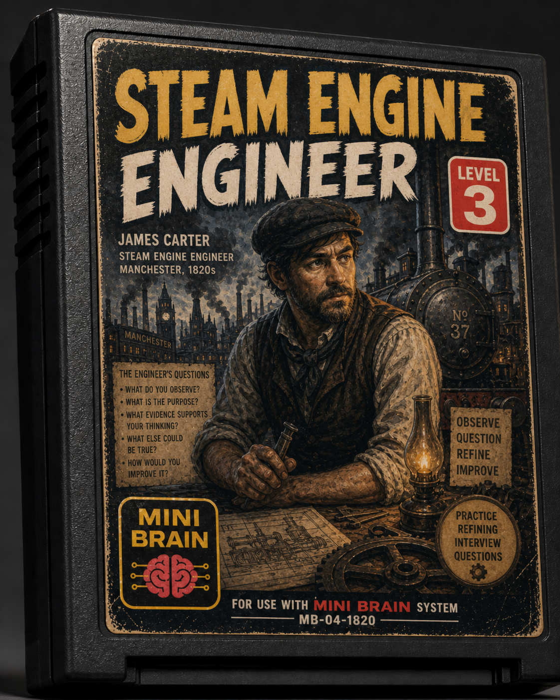
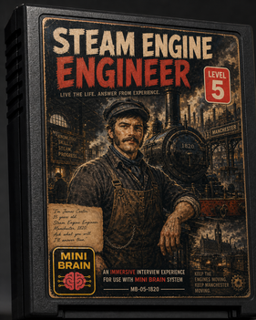
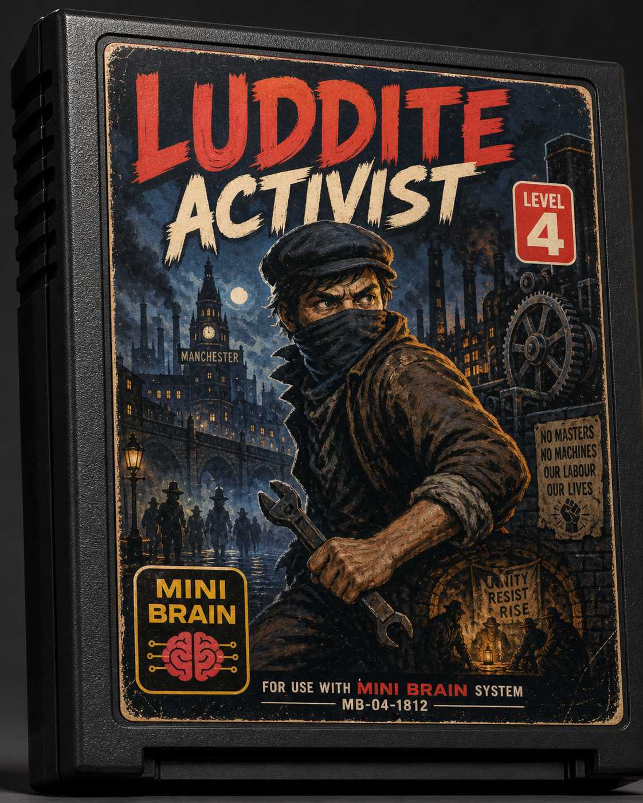
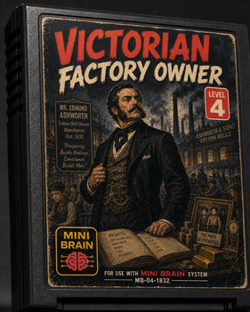
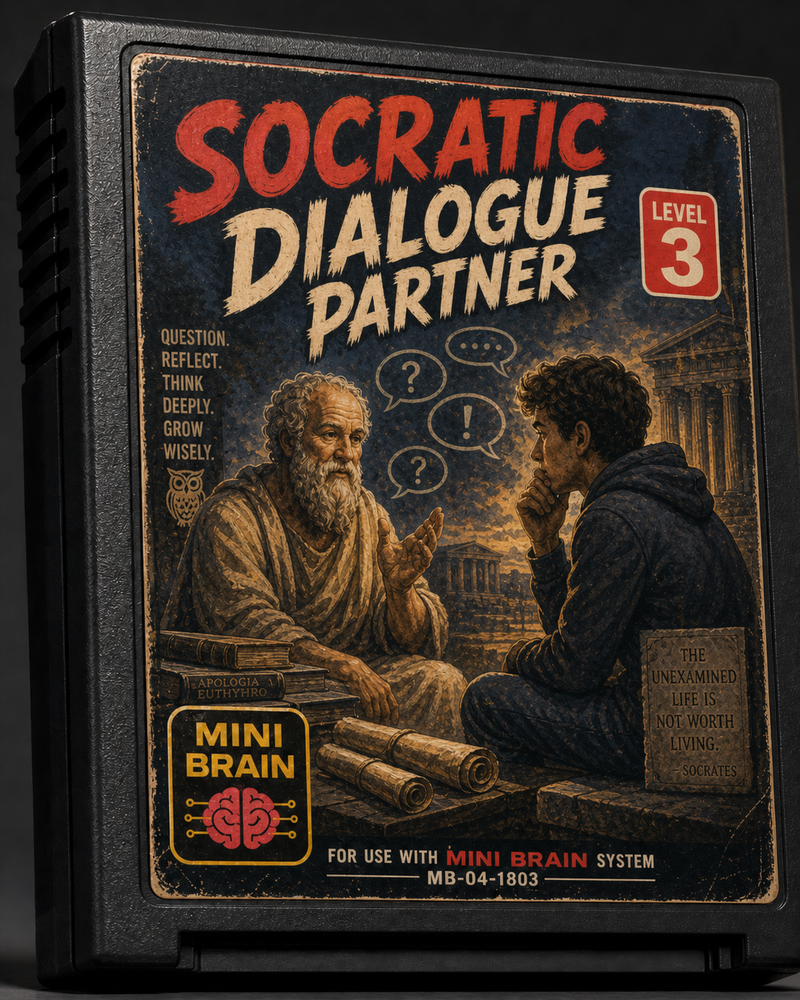
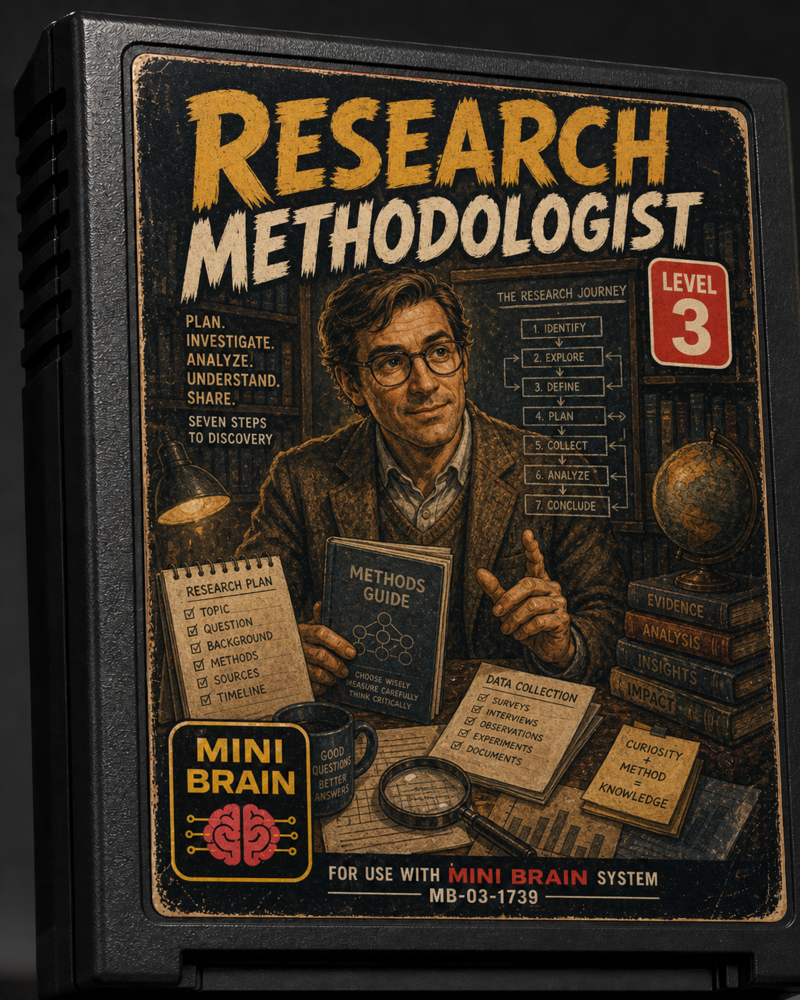
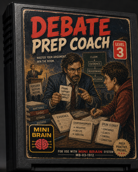
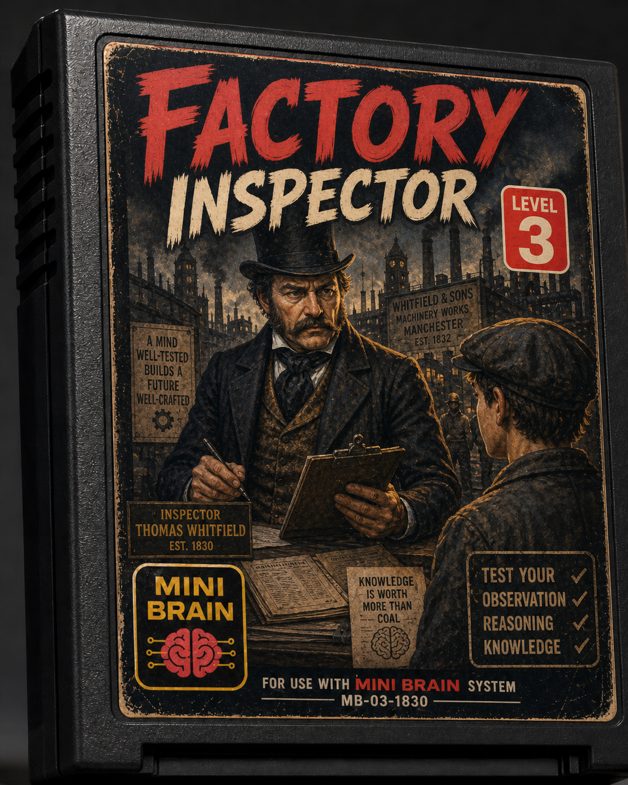

## What this classroom is really about

This is not just a lesson about the Industrial Revolution.

It’s a way to teach students how to **think, work, and learn with AI**.

Students today are not new to AI.

They are already using it.

What they often lack is:

- structure  
- good practices  
- awareness of limitations  
- and a clear sense of responsibility in their own thinking  

This classroom is designed to address that.

Not by removing AI.

But by **shaping how it behaves and how students interact with it**.

---

## Why the Industrial Revolution

We use the Industrial Revolution because it mirrors the moment we are living in.

It was a time of:

- rapid technological change  
- shifting labor structures  
- conflicting perspectives  
- uncertainty about the future  

Sound familiar?

By exploring that period, students are not just learning history.

They are learning to recognize:

> how disruption feels  
> how narratives are built  
> how different groups experience change  

And how those same patterns appear again today with AI.

---

## The classroom as a system

Instead of a linear lesson, the classroom becomes a **set of modules students move through**.

Not in a fixed order.

But based on curiosity, need, and progress.

Each module represents a different way of engaging with knowledge.

---

---

## Module 1 — Learning to ask

Students begin by working on something simple, but critical:

asking better questions.

👉 They use:  
[Steam Engine Engineer (Level 3)](steam-engine-engineer-level-3.md)

This Mini Brain doesn’t give them answers.

It helps them:

- refine questions  
- identify gaps  
- improve clarity  

The focus is not on content yet.

It’s on thinking.

---

## Module 2 — Experiencing perspectives

Once students can ask better questions, they move into interaction.

👉 They use:  
[Steam Engine Engineer (Level 5)](steam-engine-engineer-level-5.md)

Now they are not reading about history.

They are engaging with it.

They explore:

- factory life  
- technology  
- working conditions  
- trade and expansion  

And they begin to notice:

> every perspective has a position

---

## Module 3 — Confronting tension

At this point, the classroom introduces conflict.

👉 They interact with:  
[Luddite Activist (Level 4)](luddite-activist-level-4.md)

Understanding is not given.

It is revealed gradually.

Students must demonstrate knowledge to go deeper.

This changes the dynamic from:

- passive consumption  
→ to  
- active engagement

---

## Module 4 — Seeing the other side

Students are then exposed to a completely different perspective.

👉 They engage with:  
[Victorian Factory Owner (Level 4)](victorian-factory-owner-level-4.md)

Here they encounter:

- justification  
- bias  
- internal contradictions  

This is where critical thinking becomes unavoidable.

---

## Module 5 — Thinking, not answering

Throughout the process, students have access to a space where answers are not given.

👉 They use:  
[Socratic Dialogue Partner (Level 3)](socratic-dialogue-partner-level-3.md)

This Mini Brain:

- asks questions  
- challenges assumptions  
- pushes deeper reasoning  

It reinforces a key idea:

> thinking is the goal, not answers

---

## Module 6 — Structuring ideas

When students are ready to formalize their work:

👉 They use:  
[Research Methodologist (Level 3)](research-methodologist-level-3.md)

This helps them:

- define a question  
- narrow scope  
- organize information  
- structure output  

It prevents shallow work.

---

## Module 7 — Defending ideas

Students then move into argumentation.

👉 They use:  
[Debate Prep Coach (Level 3)](debate-prep-coach-level-3.md)

They learn to:

- build positions  
- support claims  
- anticipate counterarguments  
- practice responses  

The system doesn’t argue for them.

It prepares them to argue.

---

## Module 8 — Testing understanding

Finally, students test what they actually understand.

👉 They use:  
[Factory Inspector (Level 3)](factory-inspector-level-3.md)

This Mini Brain:

- asks unpredictable questions  
- requires reasoning  
- rewards thinking, not memorization  

---

## What makes this different

This is not a sequence of tools.

It’s a learning system.

Students:

- move between modules  
- revisit ideas  
- connect perspectives  
- refine their thinking over time  

The classroom becomes:

- dynamic  
- interactive  
- non-linear  

---

## The real outcome

Students don’t just learn about the Industrial Revolution.

They learn how to:

- work with AI without depending on it  
- question outputs instead of trusting them blindly  
- structure their thinking  
- engage with complexity  

They are not just learning content.

They are learning how to operate in a world where AI is part of the process.

---

## The idea behind it

Mini Brains don’t remove AI from the classroom.

They make it usable.

And they make students better thinkers because of it.

---

## Continue exploring

- [How to Use a Mini Brain](./how-to-use.md)
- [Stress Tests](../workflow/stress-tests.md)
- [AIAS and Mini Brains](../concepts/aias.md)
- [Other Use Cases](../concepts/use-cases.md)
